### RDS creation:

* Deploy RDS/ Azure SQL
* Map DNS record in Route53/private DNS(private endpoint)
* Install mysql workbench
* Connect to the RDS via Mysql Workbench

### Steps: 

1. Create database for load data to rds.
     
    * Here we have two ways

       * Connect through EC2 Inastance
       * Connect through MYSQL Workbench (install mysql workbench in local system)
       
2. Map DNS record in Route53/private DNS(private endpoint)

    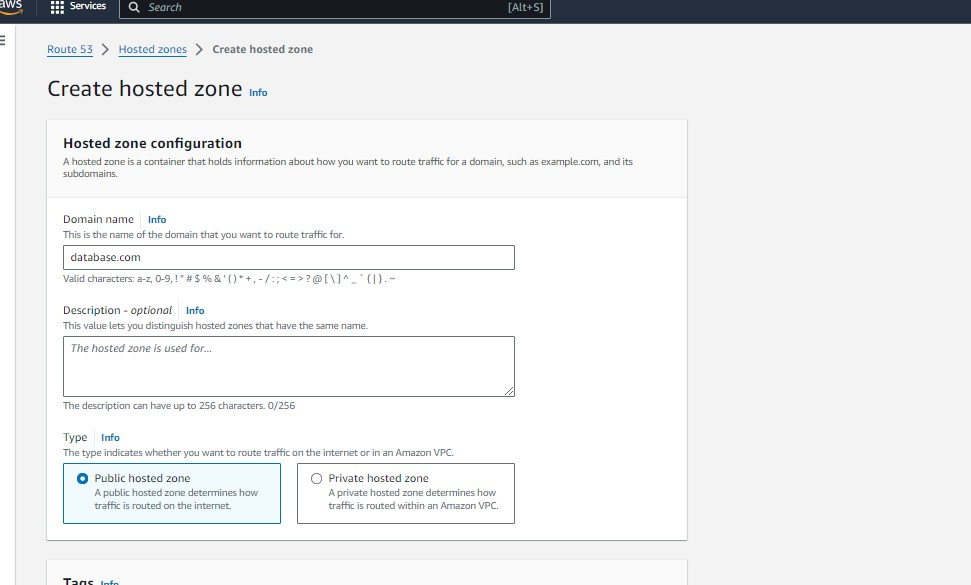
    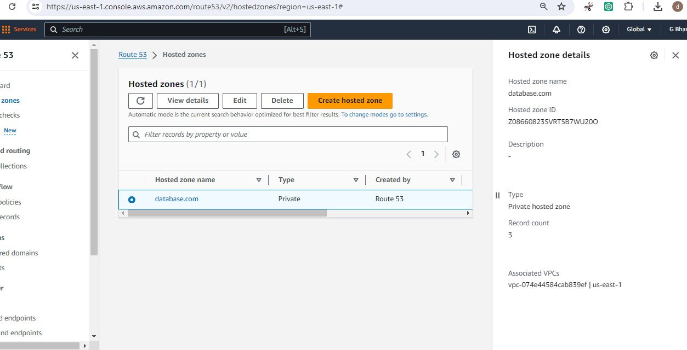
    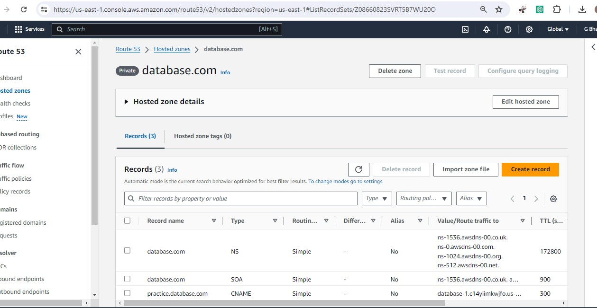
    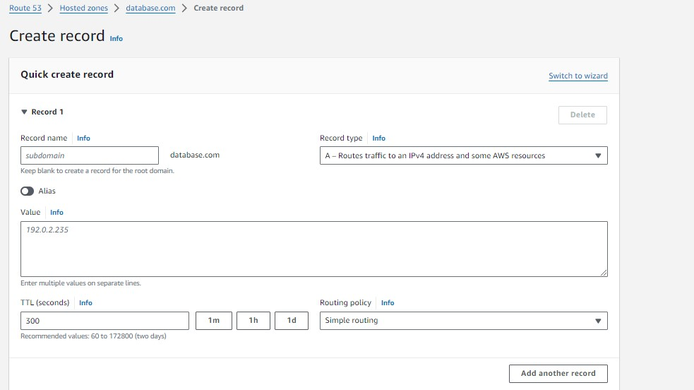
    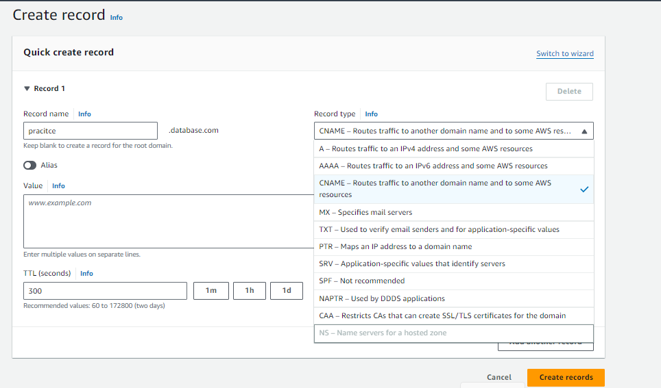
    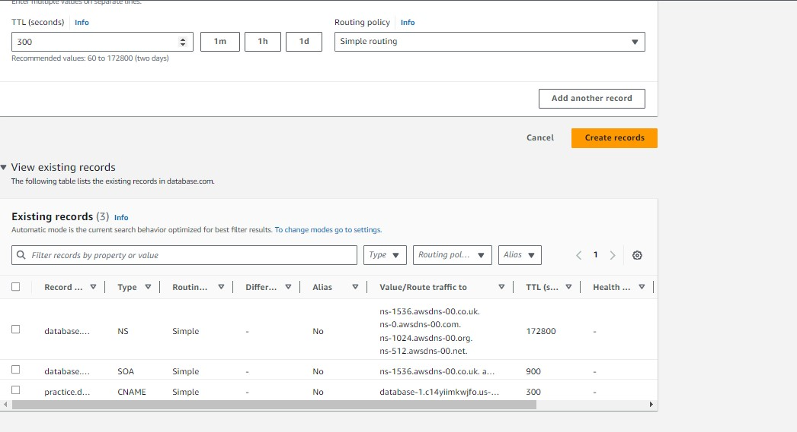
    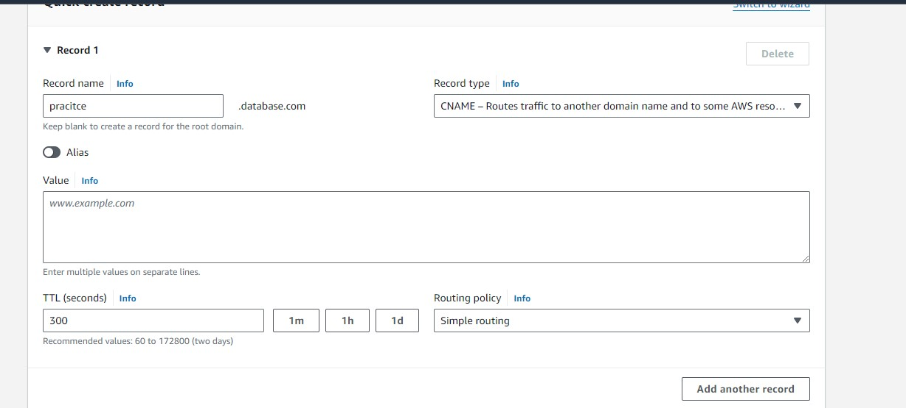

3. Install MYSQL Workbench, Currently we are using **RDS Endpoint** connect to **MYSQL Workbench**

    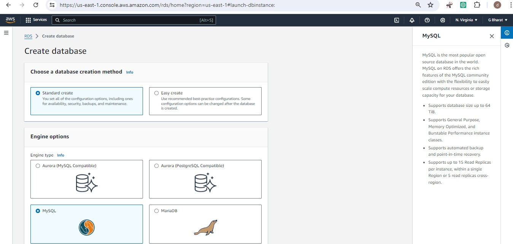
    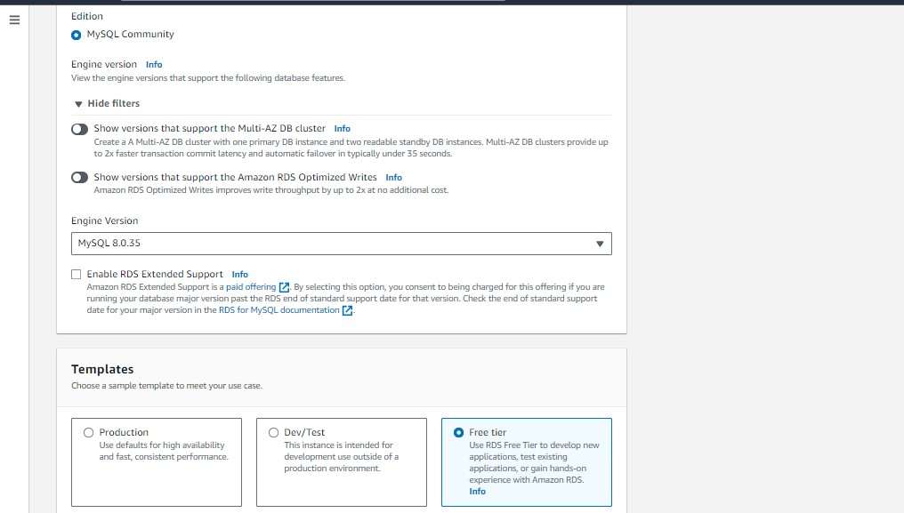   
    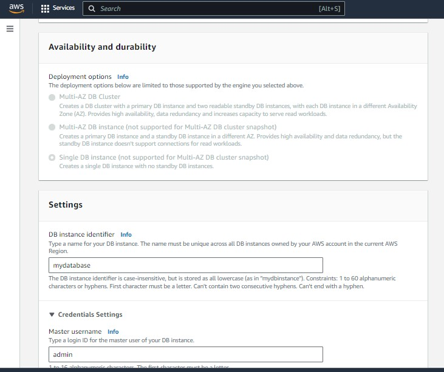
    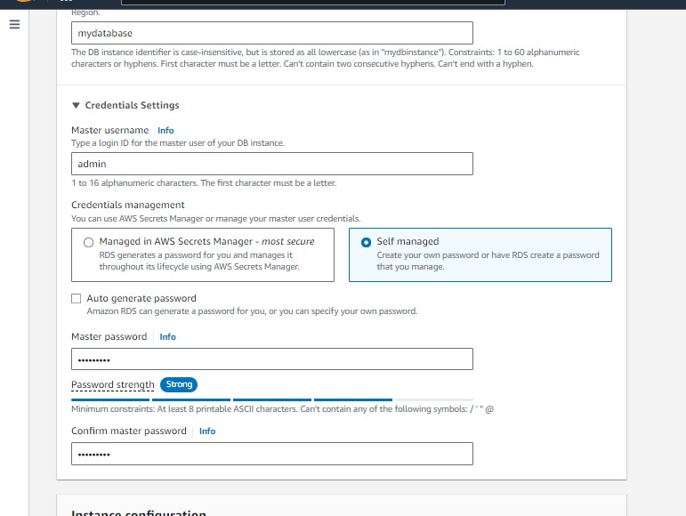
    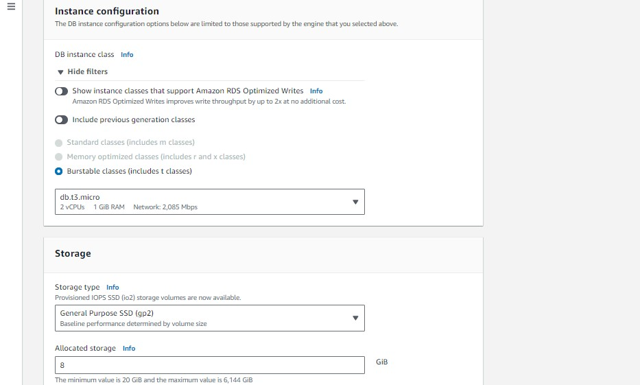
    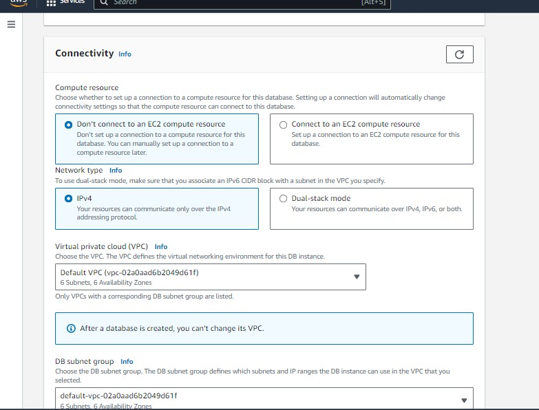
    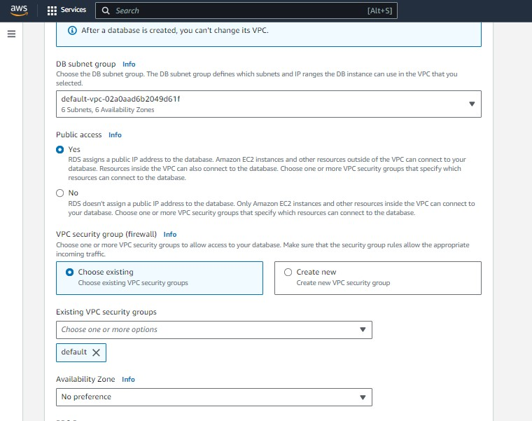
    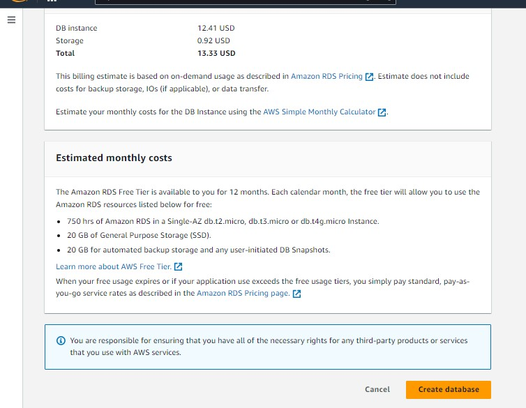
    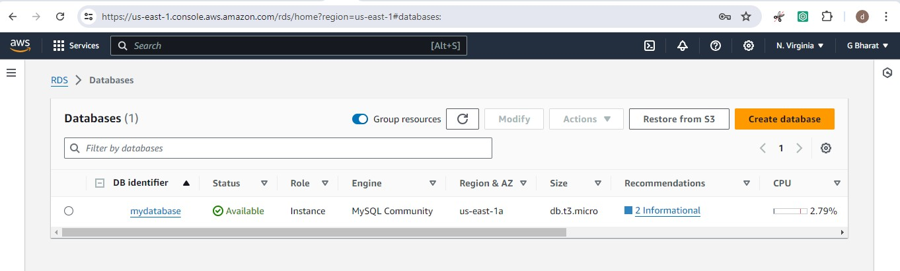

    * Till now created database in aws, now connect to mysql workbench using rds endpoint, username, password which is give to created above database in aws. 

    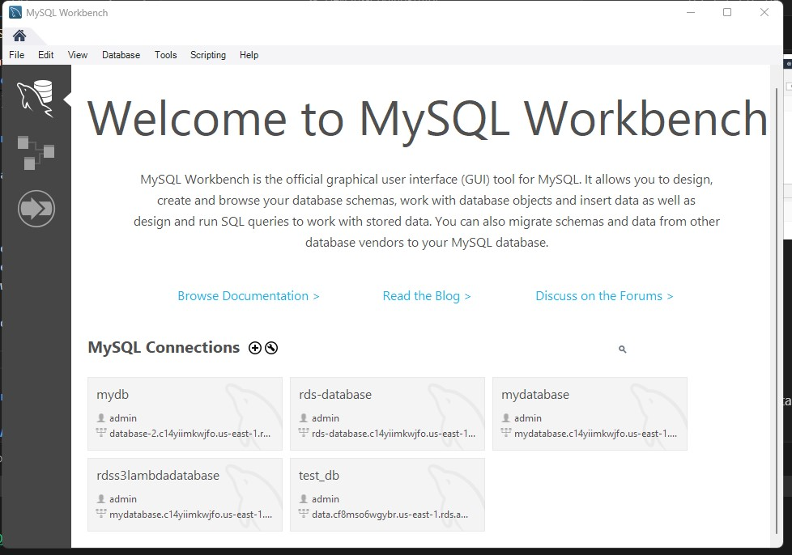
    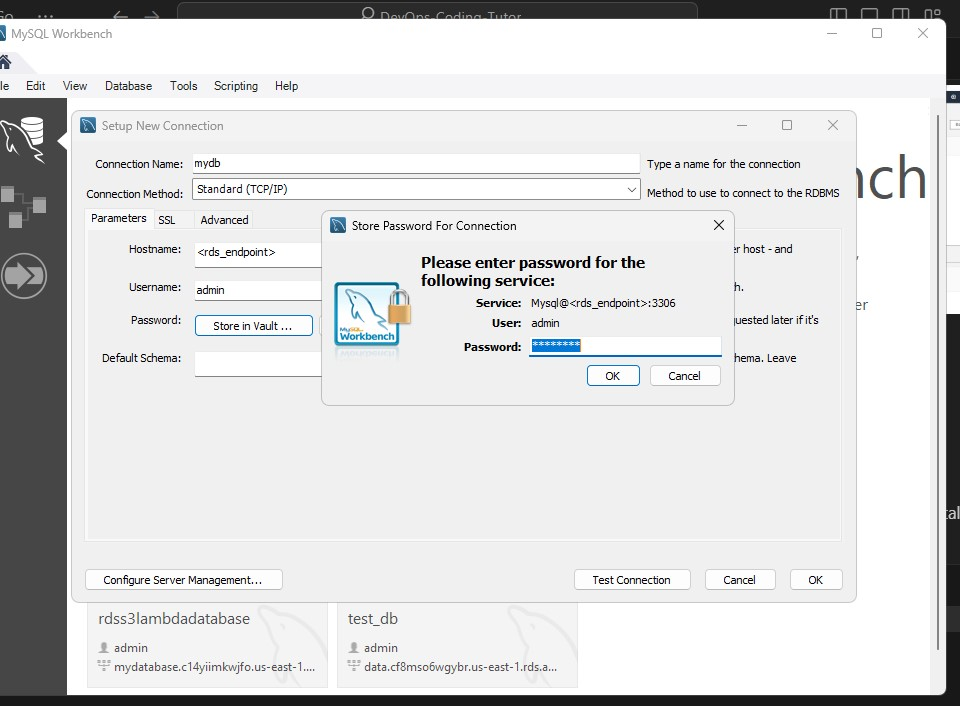
    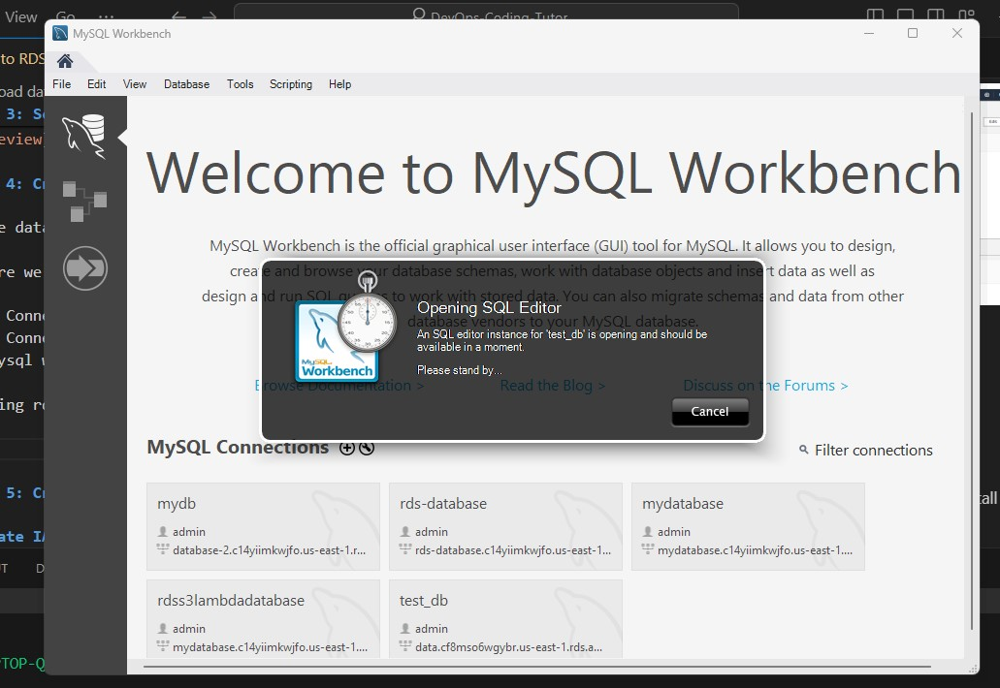
    

    