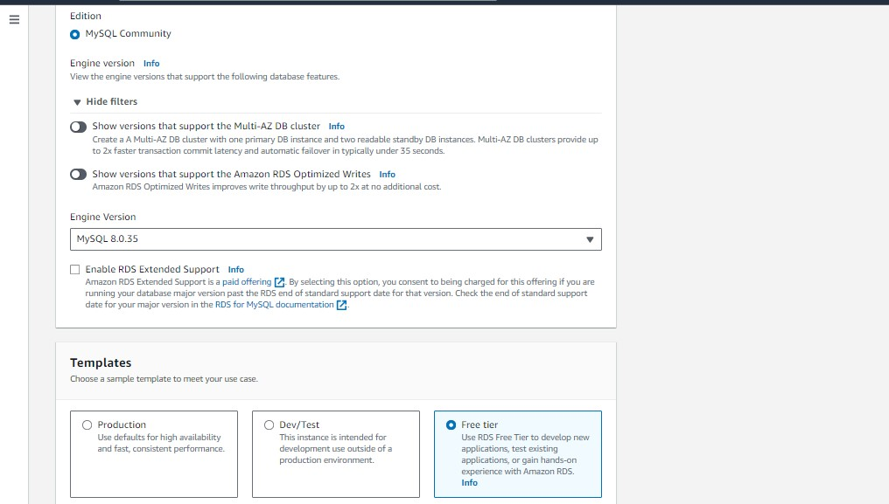
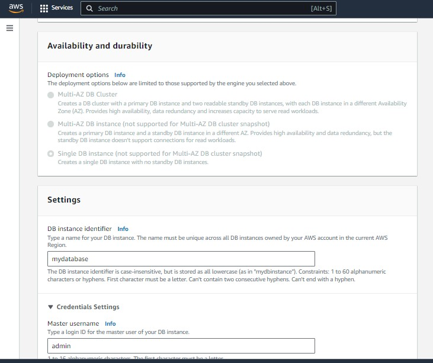
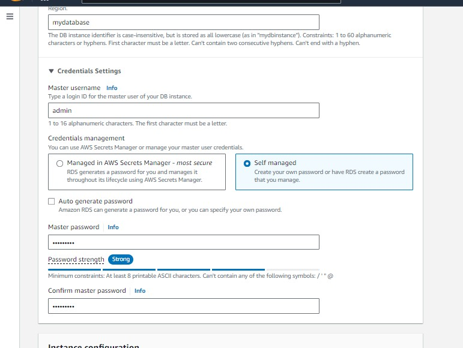
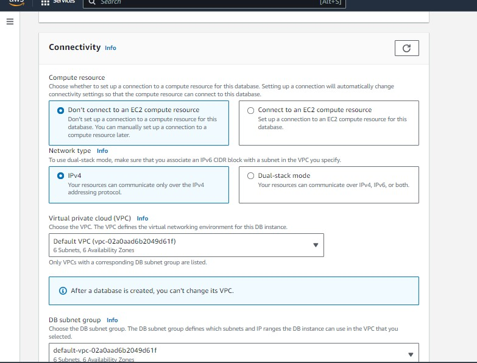
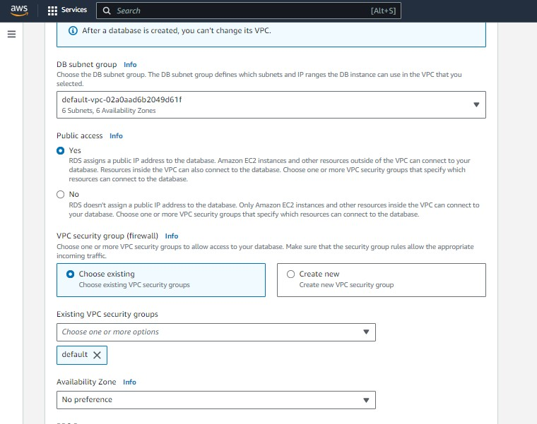
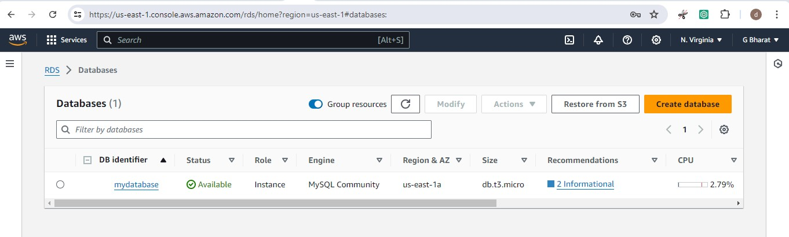
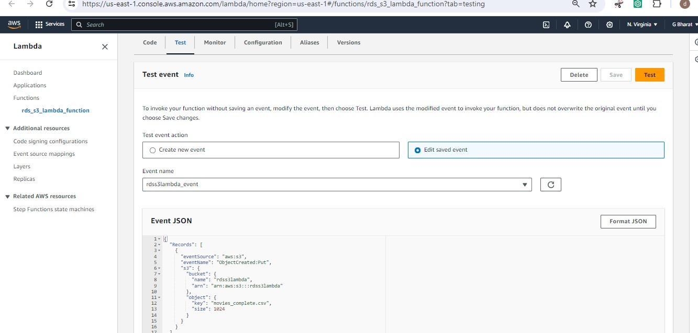
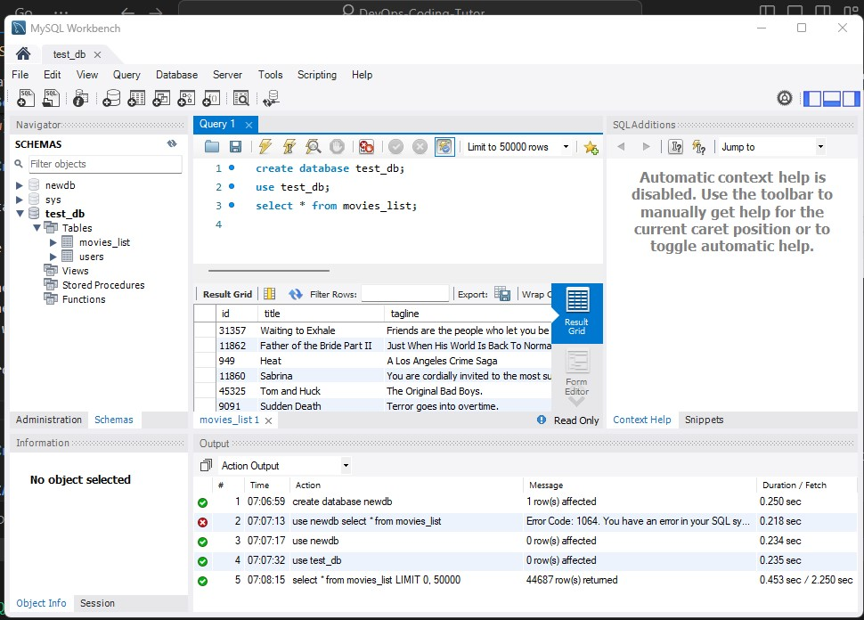
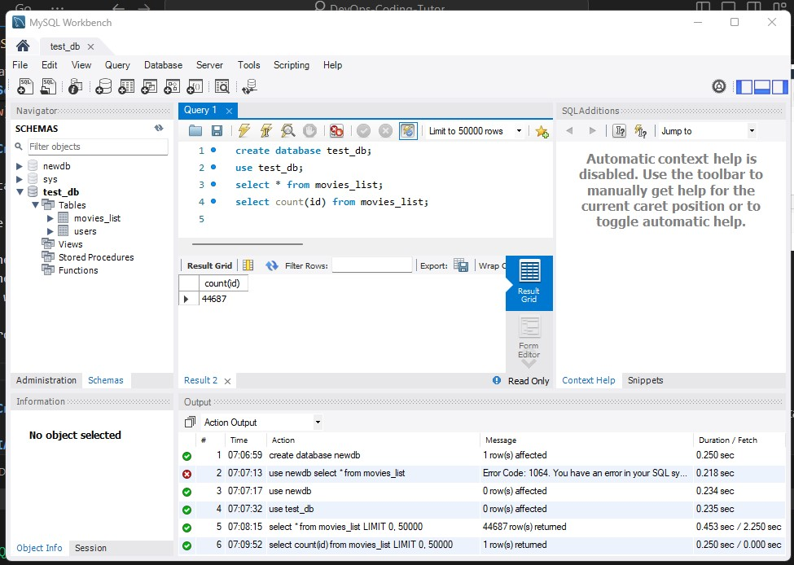
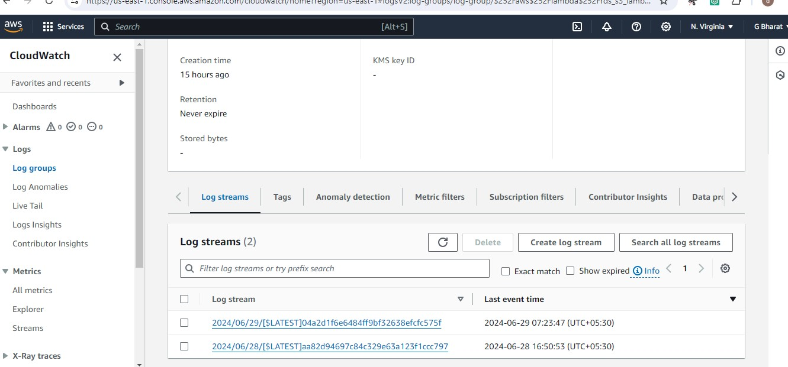

### Load data from S3 to Aurora MySQL RDS Cluster using Lambda. SNS & SQS for notifications and queuing, and also cloudwatch for logs? 

### Set Up the S3 Bucket

1. Create an S3 Bucket:
    * Go to the S3 console in AWS.
    * Click "Create bucket" and follow the prompts to create a new bucket.

    

2. Upload Data to S3:

    * Upload the CSV or any other data files to the S3 bucket

    

### Step 2: Set Up SQS Queue
      
1. * Create an SQS Queue:

    * Go to the SQS console in AWS.
    Click "Create queue" and choose the queue type (Standard).
    * Name your queue and create it.

    


### Step 3: Set Up SNS Topic

1. Create an SNS Topic:

    * Go to the SNS console in AWS.
    * Click "Create topic" and choose the topic type (Standard).
    * Name your topic and create it.

    
    

2. Create an SNS Subscription for email:

    * Click on your newly created topic.
    * Click "Create subscription."
    * Choose the protocol (Email) and set the endpoint (your email address).
    * Confirm the subscription through the email you receive.

    
    
    

3. Create and Subscription for SQS Queue to SNS Topic:

    * Go back to the SNS topic you created.
    * Click "Create subscription."
    * Choose the protocol as "Amazon SQS."
    Select your SQS queue ARN.

    

### Step 4: Create RDS for Database

1. Create database for load data to rds
     
    * Here we have two ways

       * Connect through EC2 Inastance
       * Connect through MYSQL Workbench (install mysql workbench in local system)

    * Currently we are using **RDS Endpoint** connect to **MYSQL Workbench**

    
       
    
    
    
    
    
    
    

    * Till now created database in aws, now connect to mysql workbench using rds endpoint, username, password which is give to created above database in aws. 

    
    
    
    
### Step 5: Create an IAM Role for Lambda

1. **Create IAM Role**:

    * Go to the IAM console in AWS.
    * Click "Roles" and then "Create role."
    * Choose "Lambda" as the service that will use this role.
    * Attach* policies for S3, SNS, SQS, and RDS access.
        * ```AmazonRDSFullAccess```
        * ```AmazonS3FullAccess```
        * ```AmazonSNSFullAccess```
        * ```AmazonSQSFullAccess```
        * ```AWSLambdaBasicExecutionRole```

    

### Step 6: Create the Lambda Function

1. Create Lambda Function:

    * Go to the Lambda console in AWS.
    * Click "Create function" and choose "Author from scratch."
    * Name your function and choose the runtime (Python 3.8, Python 3.12).
    * Set the execution role to the one you created in Step 4.

    
    
    

    * Click "Created lambda function" and go to code tab and paste the code in lambda function

    
     

```
import boto3
import pymysql
import os

s3_client = boto3.client('s3')
sns_client = boto3.client('sns')
sqs_client = boto3.client('sqs')

def lambda_handler(event, context):
    bucket_name = os.environ['BUCKET_NAME']
    rds_endpoint = os.environ['RDS_ENDPOINT']
    db_user = os.environ['DB_USER']
    db_password = os.environ['DB_PASSWORD']
    db_name = os.environ['DB_NAME'].strip()  # Remove any leading/trailing spaces
    sns_topic_arn = os.environ['SNS_TOPIC_ARN']
    sqs_queue_url = os.environ['SQS_QUEUE_URL']
    
    
    connection = None
    cursor = None

    try:
        connection = pymysql.connect(host=rds_endpoint, user=db_user, password=db_password)
        cursor = connection.cursor()
        
        # Ensure the database exists
        cursor.execute(f"CREATE DATABASE IF NOT EXISTS {db_name}")
        cursor.execute(f"USE {db_name}")
        cursor.execute("truncate table movies_list")
        
        # Ensure the table exists
        cursor.execute("""
            CREATE TABLE IF NOT EXISTS movies_list (
                id INT,
                title VARCHAR(100),
                tagline VARCHAR(100)
            )
        """)
        
        for record in event['Records']:
            s3_object_key = record['s3']['object']['key']
            
            # Download the file from S3
            download_path = f'/tmp/{s3_object_key}'
            s3_client.download_file(bucket_name, s3_object_key, download_path)
            
            # Load the data into Aurora MySQL
            with open(download_path, 'r') as file:
                csv_data = file.readlines()
                for row in csv_data:
                    # Assuming CSV format: id,title,tagline
                    row_data = row.strip().split(',')
                    cursor.execute(
                        "INSERT INTO movies_list (id, title, tagline) VALUES (%s, %s, %s)",
                        (row_data[0], row_data[1], row_data[2])
                    )
            
            connection.commit()
            
            # Send notification to SNS
            sns_client.publish(
                TopicArn=sns_topic_arn,
                Message=f"File {s3_object_key} has been processed and loaded into RDS."
            )
            
            # Send message to SQS
            sqs_client.send_message(
                QueueUrl=sqs_queue_url,
                MessageBody=f"File {s3_object_key} processed."
            )
    
    except pymysql.MySQLError as e:
        print(f"Error: {e}")
        raise e
    
    finally:
        if cursor:
            cursor.close()
        if connection:
            connection.close()
    
    return {
        'statusCode': 200,
        'body': 'File processed and loaded into RDS successfully'
    }

```
2. Configure Lambda Environment Variables:

    * In the Lambda function configuration, set environment variables for:
        * BUCKET_NAME
        * DB_NAME
        * RDS_ENDPOINT
        * DB_USER
        * DB_PASSWORD
        * SQS_QUEUE_URL
        * SNS_TOPIC_ARN

    * Pass the above environment variables in 
        * lambda configuration 
        * go to environment variables 
        * click 'edit' 
        * Add 'environmental variables'
        
        
        

3. **Add Trigger for S3:**

    * In the Lambda function configuration, add an S3 trigger.
    * Select the S3 bucket you created.
    * Configure the event type (All Object Created).

    
    
     

4. **Add Layers for lambda function**

    * First before adding layer download code dependencies and compress into zip folder follow below steps.

        *  Go to ec2 instance which have internet access use below commands for installing ```pymysql``` dependencies 

            * Using pip : ```pip install pymysql```
            * Using a Requirements File

                1. Add pymysql to your requirements.txt file: ```pymysql```
                2. Run the following command to install all dependencies listed in requirements.txt: ```pip install -r requirements.txt```

        * Now connect your ec2 instance through local command line.
            
            * Here using ```put``` means, you want to send files form **local** to **server**.
            
            * If you use ```get``` means, you want to pull files from **server** to **local**.
        * So currently use  ```get``` for getting dependencies zip folder for server use below commands.

            * ```sftp -i .\<keyname.pem> ubuntu@<ip_address>``` (to connect server locally)
            * ```sftp get ./<filename> /home/ubuntu``` (pulling file form server)
            * ```exit```
        
    * In the lambda function we need to add layers for python code as needed few dependencies
    * Below Additional resources you will found layer and while creating layer upload zip file.

    
    
    

    * And also select layer in code

    
    

5. Create test
    
    *  In the test , create event and paste code as given below , save it and before clicking  test check databate is created or not.
    *  And check as given environment variables database is created or not in mysql workbench.

      

```
{
  "Records": [
    {
      "eventSource": "aws:s3",
      "eventName": "ObjectCreated:Put",
      "s3": {
        "bucket": {
          "name": "rdss3lambda",
          "arn": "arn:aws:s3:::rdss3lambda"
        },
        "object": {
          "key": "movies_complete.csv",
          "size": 1024
        }
      }
    }
  ]
}
```


6. Now click test , see execution results and you will get result like below

    

    * check in database is data uploaded or not.

    
    
    

### Step 7: You can also check in CloudWatch log group

1. Go to monitor tab in lambda function --> click "view log groups" --> it will directly redirect to cloudwatch log groups. 

    
    
    
    

2. In SQS you can see count that how many notifications received to mail.

    
    
3. You can aslo see mails notification after data uploaded form S3 to RDS, and 
    
    
       

**Task Completed**. 


