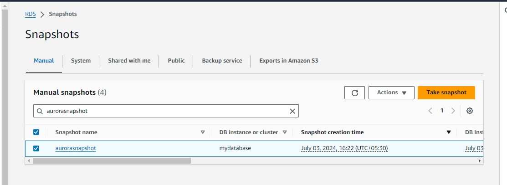
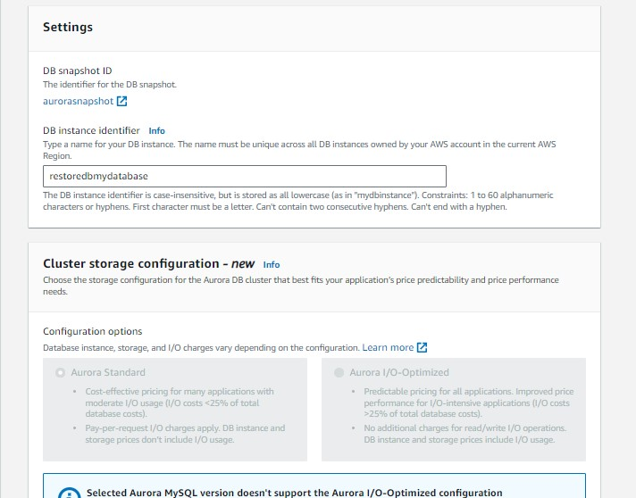
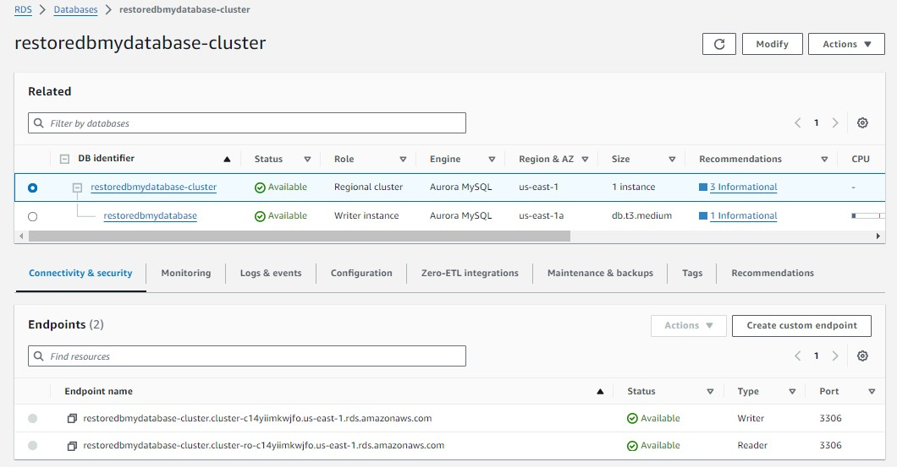

### **Upgrade aws aurora mysql from 5.7 to 8.0.32 (5.7 will be deprecate very soon)**


#### step-by-step guide to upgrade AWS Aurora MySQL from version 5.7 to 8.0.32:

1.  create a rds aurora mysql sql and connect to rds db using mysql workbench.
2. apply any dummy data on mysql 5.7.
3. Take a snapshot of db
4. create Clster parameter group and db parameter group for aurora mysql 8
5. restore db with mysql 8 (don't forget to select cluster parameter group and  db parameter group)
6. check the status of the version(if it fail check the error logs and troubleshoot it)
7. do restore again.

#### Step 1: Create an RDS Aurora MySQL Database:

1. Log in to the AWS Management Console.
2. Navigate to **RDS > Databases > Create database.**
3. Choose Standard and Amazon Aurora.
4. Select Aurora MySQL


5. Choose version 5.7.


6. Configure your database settings (DB instance class, storage, etc.).
Usually credentials setting in real time we need to store credentials in AWS Secrect manager.present pratice purpose you can use 'self managed'


7. Select storage as per requirement.
    * memory optimized price is high.
    * burstable classes price is low. 
    * So select based on requirement.

    
    
    

8. Create the database and before that for practice select public databse 'yes' and create database


#### Step 2: Connect to RDS using MySQL Workbench

1. Open MySQL Workbench.
2. Create a new connection:
3. **Hostname**: The endpoint of your Aurora DB instance.
4. **Port**: Default is 3306.
5. **Username**: Master username.
6. **Password**: Master password.
7. Test the connection and save.

    

#### Step 3: Apply Dummy Data on MySQL 5.7.

1. In MySQL Workbench, connect to your Aurora DB.
2. Execute SQL scripts to create tables and insert dummy data, e.g: like below queries.For creating database use below queries 

```
CREATE DATABASE testdb;
USE testdb;

CREATE TABLE users (
    id INT AUTO_INCREMENT PRIMARY KEY,
    name VARCHAR(100),
    email VARCHAR(100)
);

INSERT INTO users (name, email) VALUES ('John Doe', 'john.doe@example.com'), ('Jane Smith', 'jane.smith@example.com');

Select * from users;
```
 

#### Step 4: Take a snapshot of Database

1. Navigate to **RDS > Databases**.
2. Select your database instance.
3. Click on **Actions > Take snapshot**.
4. Name your snapshot and take it.




#### Step 5: Create Cluster and DB Parameter Groups for Aurora MySQL 8

1. Navigate to RDS > Parameter groups > Create parameter group.
2. For Cluster parameter group:
    * Select Aurora MySQL.
    * Select Aurora MySQL version 8.0.
    * Name your parameter group and create it.
    
3. For DB parameter group:
    * Select Aurora MySQL.
    * Select Aurora MySQL version 8.0.
    * Name your parameter group and create it.
    
    

#### Step 6: Restore DB with MySQL 8

1. Navigate to **RDS > Snapshots**.
2. Select the snapshot you created.
3. Click on **Actions > Restore snapshot**.





4. Goto Advanced settings:
    * Select the Aurora MySQL version 8.0.32.
    * Choose the cluster and DB parameter groups you created earlier.
    * Configure the rest of the settings as needed.

    
5. Review and Click Restore DB Cluster.

#### Step 7: Check the Status and Troubleshoot if Needed

1. Monitor the status of the restoration process in the RDS console.


2. If the process fails, check the error logs, otherwise if successed you will get like below db instance available, you can see in log and events:
3. Navigate to **RDS > Databases**.
Select your restored DB instance.

4. Click on **Logs & events** to view error logs.


5. Troubleshoot the errors based on the log information (e.g., incompatible parameters, missing configurations, etc.).

6. Check is database is restored or not in mysql workbench.

    * use rds restoremydatabase endpoint to connect mysql workbench and before that do add inbound rules in security group

    

