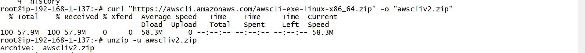
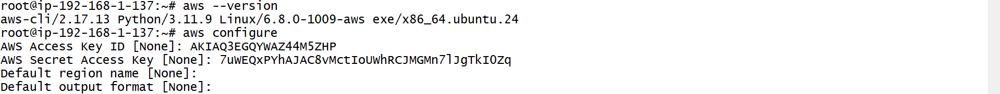
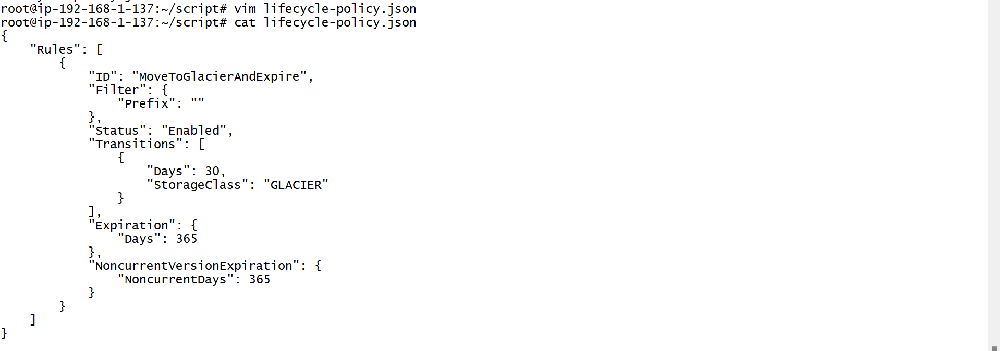
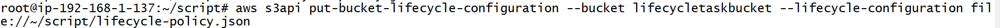
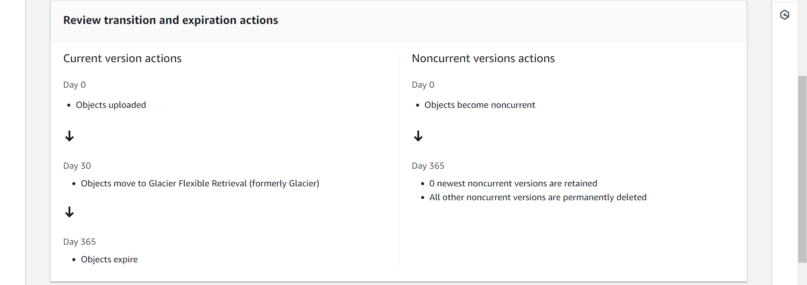

## ways to apply the S3 lifecycle policy using the AWS CLI and different scripting languages like Bash and PowerShell.

## need to configure cli

## create one folder and changed folder in that folder i created file in that file i put a json seript

 ```
 aws s3api put-bucket-lifecycle-configuration --bucket lifecycletaskbucket --lifecycle-configuration file://~/script/lifecycle-policy.json
```


## output:-


# Task completed
